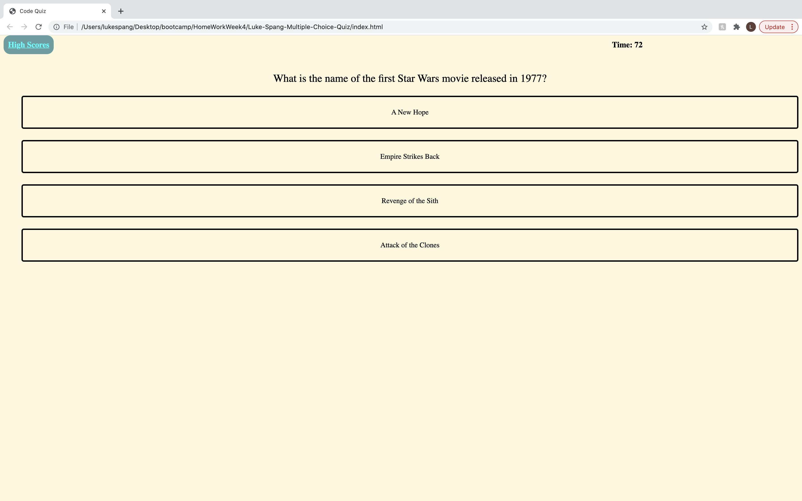
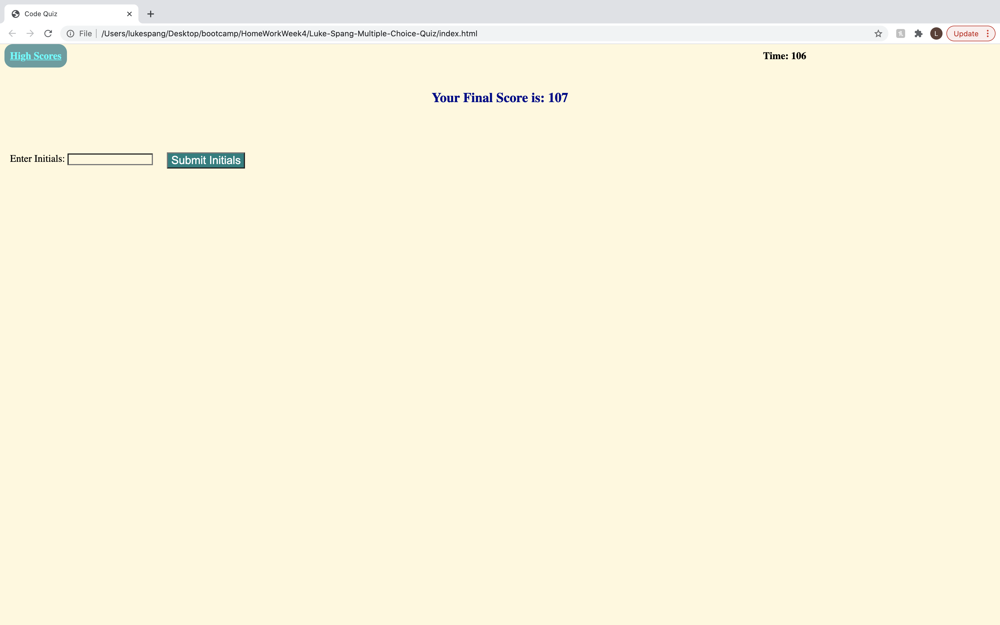
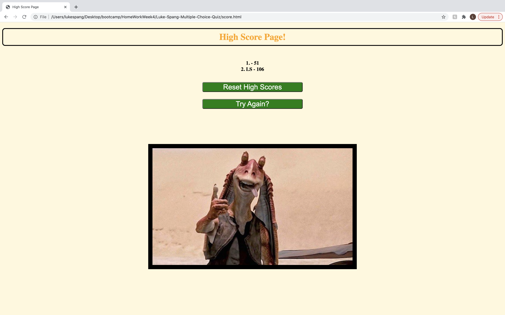

# Luke-Spang-Multiple-Choice-Quiz

Are you a passionate Star Wars fan? Test your knowledge by taking this 4 questions quiz! The quiz is powered by html, css, and javascript. 

When the user takes this quiz they are presented with

1. A start button on the home page.
2. A timer that starts with the click of the start button.
3. Multiple questions for the user to cycle through when answering.
4. When questions are answered incorrectly, time is subtracted from the timer.
5. When all questions are answered of the timer hits 0, the quiz ends. 
6. When the quiz is completed, the user is presented with their score.
7. The user can log their initials and save their high score to the high score list.
8. There is a link that takes the user to the high score page where they can view their score, as well as previous saved attempts.
9. On the high score page, the user can reset all high scores, or choose to retake the test. 

Extra effects are sound effects for right and wrong answers, styling and images by css, and extra points awarded for correct answers. 

The quiz is currently live as of 4/24/2021. It can be seen below in screen shots, or viewed live at _________

